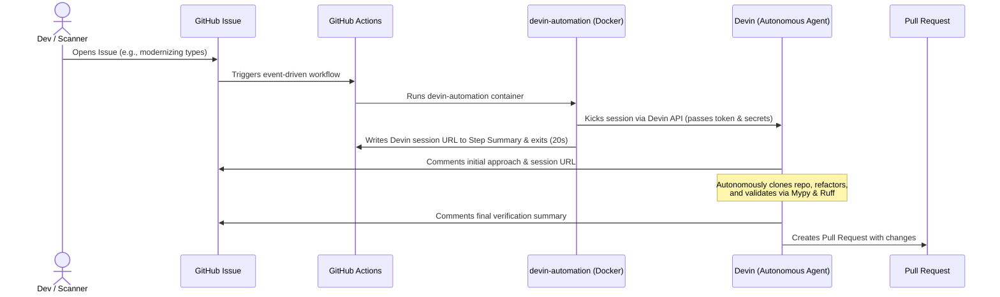

# Devin Automation: Event-Driven Autonomous Remediation

This directory contains the automation scripts to trigger a Devin session directly from a GitHub Issue event. 

By leveraging the **Devin API**, we have built a highly efficient pipeline that automates routine repository maintenance, codebase modernizations, and security fixes.

---

## 📋 Executive Summary (What, How, Why, When)

Here is a summary of our autonomous remediation system, aligned with our technical presentation:

### 1. **What**: The Problem We Are Solving
As engineering teams grow, routine maintenance tasks (such as refactoring legacy syntax, resolving security warnings, and fixing minor bugs) become major bottlenecks. Human engineers are forced to stop their core feature work, clone the repository, write the fix, check it, and open a Pull Request. 
This system solves this challenge by **fully automating routine remediation**. When a routine issue is detected, Devin is automatically dispatched to solve it, saving valuable developer time.

### 2. **How**: The Architecture in Action
Our workflow is event-driven and optimized for resource efficiency:
* **Trigger**: A new issue is opened in GitHub (either manually or by a security scanner like CodeQL).
* **Workflow**: GitHub Actions fires a lightweight Docker container that calls the Devin API to spin up a work session.
* **Instant Exit**: The Actions runner logs the Devin URL to the GitHub Actions Job Summary and **terminates successfully in just 20 seconds**—completely eliminating runner wait costs.
* **Self-Reporting (Observability)**: Instead of the CI/CD runner polling Devin, Devin **directly self-reports** on the GitHub Issue:
  1. **Before starting**: Devin comments its planned technical approach on the Issue.
  2. **During the run**: Devin autonomously runs our static analysis suite (e.g., Mypy, Ruff) to guarantee type-safety and syntax correctness.
  3. **On completion**: Devin comments its final verification summary and creates a Pull Request.

### 3. **Why**: The Devin Advantage
Traditional static code-mod scripts or standard linters are too rigid. They can suggest changes, but they cannot think through compiler errors, adapt to unexpected issues, or write clear summaries.
Devin acts as a **reasoning-capable autonomous engineer**. It thinks, validates, and communicates. As shown in our demo (modernizing type hints to PEP 585 and PEP 604 standards), Devin successfully refactored 21 files, ran Ruff/Mypy to ensure type safety, and wrote a clean, senior-level Pull Request.

### 4. **When**: Next Steps & Extensibility
This event-driven pipeline is designed to be highly extensible. Future phases include:
1. **Slack Integration**: Adding a Slack webhook to alert the team when Devin completes a job.
2. **Auto-Merge**: Setting branch protection rules to automatically merge Devin's Pull Request once all static checks pass.
3. **Continuous Security Patching**: Connecting live Dependabot or CodeQL alert events directly to this pipeline to automatically fix security vulnerabilities the moment they are discovered.

---

## 🛠️ Architecture Detail

---

## 🚀 How to Run & Simulate

### 1. Prerequisites
You must configure the following Repository Secrets in your GitHub repository (`Settings > Secrets and variables > Actions`):
* `DEVIN_API_KEY`: Your Devin API token.
* `DEVIN_ORG_ID`: Your Devin Organization ID.
* `PERSONAL_ACCESS_TOKEN` (or default `GITHUB_TOKEN` permissions): A token with write access to issues and pull requests.

### 2. Triggering the Automation
1. Create a new GitHub Issue in your repository.
2. The GitHub Actions runner will trigger `devin-trigger.yml`.
3. It will spin up Devin in about 20 seconds and terminate, showing the Devin session URL in the Actions Summary.
4. You can follow Devin's real-time progress directly on the GitHub Issue comments, where Devin will post its plan, execution results, and finally a Pull Request.
